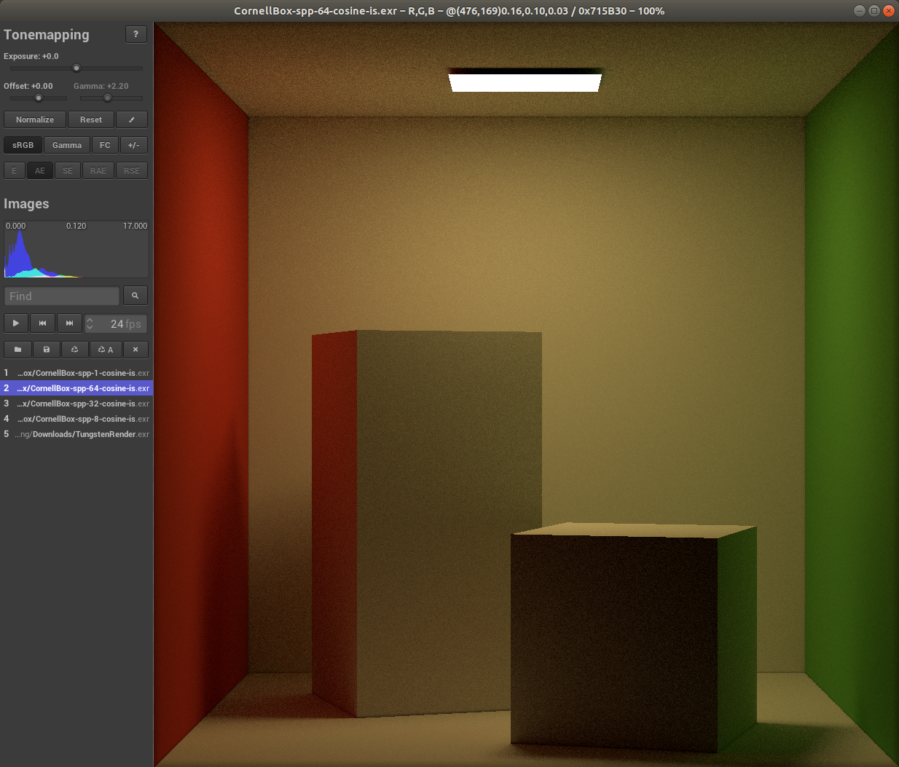

# Path Tracer
this is my coding practice for leaning path tracing


## TODO List
- [ ] run cornell box
  - [x] diffuse material
  - [ ] Phong specular term still meets some bugs. try PBR first
  - [ ] implement microfacet/pbr material
- [ ] run veach-mis
  - [ ] implement multiple importrance sampling
- [ ] implement transform module
- [ ] support different scene description file
  - [ ] mitsuba - .xml
  - [ ] pbrt - .pbrt
- [ ] implement post-processing denoiser
- [ ] implement physical camera
- [ ] the others 


## Image
### Cornell Box
Reference Image:
[Reference image is from Benedikt Bitterli]()


Render by this Path Tracer(64 SPP)



## How to build
Original environment is Windows 10 in IDE Clion with ToolChain: MINGW and Generator(NINJA)

1. clone this project
```bash
git clone https://github.com/Mirocos/PTRenderer.git --recursive
```
2. Build your own OpenCV Libraries and replace `thirdparty/opencv` with it.
3. Final Build
```BASH
mkdir build && cd build
cmake .. -DOpenCV_DIR=thirdparty/opencv && make -j
```
4. Set Environment OPENCV_IO_ENABLE_OPENEXR=1 to enable OpenCV EXR IO Support
5. (optional) you may need to copy your OpenCV LIBRARIES to the execution directory or add it to your environment path


## Development Summary
- remember to set offset for start point of secondary ray to avoid self-intersection
- set evil number(epsilon)